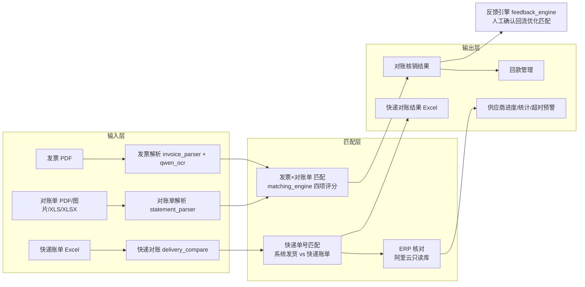
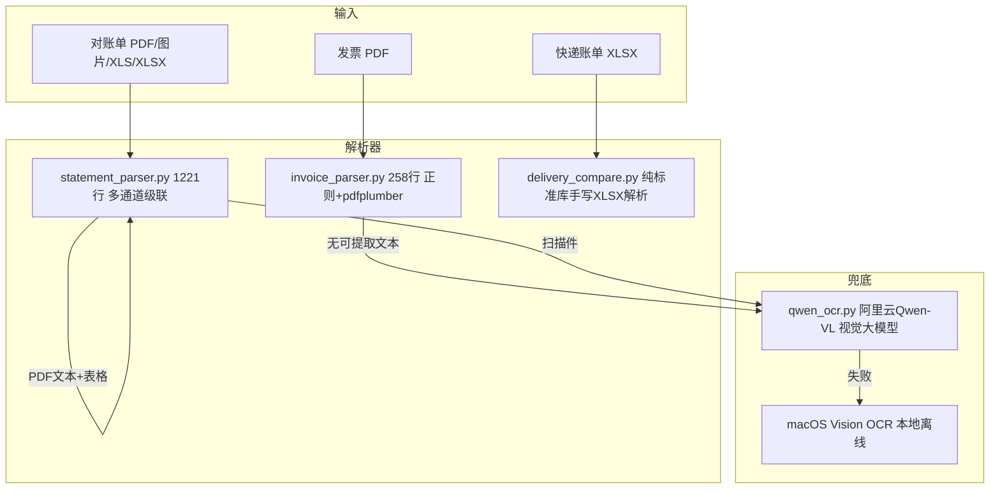

# FP 进销存财务系统（LWFP）v1 全量分析

> 分支：`reconcile-v2`
> 目的：梳理 v1 现状，定位"不对"的地方，为 v2 重构提供依据
> 数据来源：通读全部代码（backend 11 个 py 文件 + frontend 8 个 html，约 11.6k 行）

---

## 一、项目定位：这系统是干啥的

一句话：**自动对账系统** —— 把你的 **供应商对账单 / 发票 / 快递账单** 和 **系统内业务数据 + 阿里云 ERP** 自动比对、核销、找差异。



两大业务模块：

| 模块 | 输入 | 匹配方式 | 输出 |
|------|------|---------|------|
| **发票 ⇄ 对账单 核销**（主流程） | 发票 PDF、对账单 PDF/XLSX/图片 | 四项加权评分（金额40% 物料35% 数量15% 日期10%） | 自动/建议/未匹配三级结果 |
| **快递对账**（独立子模块） | 快递账单 Excel | 快递单号精确匹配 | 匹配成功/仅系统/仅快递账单 三类 Excel |

---

## 二、系统架构

| 层 | 技术 | 说明 |
|----|------|------|
| 后端 | Flask (Python 3.9) | `app.py` 4306 行，约 80 个 API 路由 |
| 数据库 | **MySQL**（SQLite 已清理） | 业务库 `fp`（写入）+ ERP 库（查询） |
| 前端 | 原生 JS + 独立 HTML 页 | 8 个页面，非 Ant Design |
| 部署 | Docker + host 网络 | 107 服务器 8090 端口 |

**双库架构**（约定：写入走本地 107，查询走阿里云）：

| 用途 | 本地开发 | 107 Docker |
|------|---------|-----------|
| FP 业务写入 | `127.0.0.1:3306/fp` | `127.0.0.1:3306/fp`（107 本机 MySQL） |
| ERP 查询 | `192.168.1.107:3306/nbgl_test` | **阿里云 `nbgl_pro`**（lwgw_pro_query 只读） |

> `config.py` 用 `/.dockerenv` 自动判断环境，Docker 内自动切阿里云 ERP。**这个规矩已写进代码，不要再动。**

---

## 三、解析层（输入 → 结构化数据）

### 3.1 四套解析器 + 云端兜底



### 3.2 发票解析 invoice_parser.py（258 行）

- 文本提取：`pdfplumber` 逐页 `extract_text()`
- 发票号码：正则 `发票号码[：:\s]+(\d{8,30})` ✅ 稳定
- 开票日期：只认 `XXXX年X月X日` / `YYYY-MM-DD` 两种格式 ⚠️
- 明细行：`_parse_item_line` **单行严格正则**（177 行），格式一不匹配就丢行 ⚠️
- 价税校验：明细合计 vs 票面合计，差 >0.02 报错 ✅

**弱点**：明细解析太脆弱，格式稍有变化整单走 Qwen OCR（慢 + 花钱）。

### 3.3 对账单解析 statement_parser.py（1221 行，最复杂）

**多通道级联设计**：

| 通道 | 逻辑 |
|------|------|
| PDF | pdfplumber 文本+表格 → 表格优先；扫描件 → Qwen OCR → macOS Vision；`_repair_lw_pdf_rows` 正则修补丢失单元格 |
| XLSX | openpyxl 读所有 sheet → 自动选明细行最多的 sheet；`_normalize_header` 归一化表头；"名称"与"品名"并存时拆分（名称=品名，品名=规格）|
| XLS | xlrd 读旧版 Excel，日期单元格特殊转换 |
| 四项资金 | 期初 + 本期开票 − 本期付款 = 期末，不平衡则 `balance_check=False` 并报差异（**只提示不阻断** ⚠️）|

### 3.4 Qwen OCR qwen_ocr.py（394 行，技术含量最高）

| 技巧 | 说明 |
|------|------|
| 多页渲染 | pypdfium2 渲染 PDF 为图片，scale=2.0 |
| 横向表格旋转 | 检测行线/列线，竖版表格自动旋转 270° |
| 分块识别 | A4 页 >900px 高切 420px 条带（60px 重叠），防 JSON 截断 |
| 表头重贴 | 每条带顶部拼第一块表头，模型永远看得到列名 |
| 跨块去重 | 重叠区重复行按签名去重 |
| 角色防呆 | prompt 明确"骊威是客户不是供应商" |
| 字段防串 | "物料编码≠订单号≠送货单号"，LW 开头=物料码，AHLW-=订单号 |

**成本问题**：一次对账单可能调用 5~10 次 API，每次 10~60 秒，多页+分块叠加更贵。

### 3.5 快递对账解析

**两套并存（v1 结构性问题）**：

| 路径 | 解析方式 | 用途 |
|------|---------|------|
| `app.py _read_delivery_sheet` | openpyxl 读模板，按"快递单号"列解析 | **前端实际走的路径** |
| `delivery_compare.py compare_one` | 纯标准库 zipfile+XML 手写解析 | 命令行/旧逻辑，含顺丰、补充表 |

`normalize_tracking`（131 行）单号规范化：去空格全角、去 `.0` 尾缀、大写、提取前缀（JT/SF/纯数字）—— 匹配质量关键。

### 3.6 解析结果落库

| 表 | 内容 |
|----|------|
| `inv_invoice` / `inv_invoice_item` | 发票头 + 明细 |
| `stm_statement` / `stm_statement_item` | 对账单头（含四项资金）+ 明细 |
| `stm_statement_record` / `allocation` | 逐行处理结果 + 分配 |
| `delivery_reconciliation_run` | 快递对账历史 |
| `rcn_reconciliation` | 发票×对账单核销结果 |

---

## 四、匹配引擎 matching_engine.py（907 行）

### 4.1 评分公式

```
总分 = 金额×40% + 物料×35% + 数量×15% + 日期×10% (+ 反馈加分 0~20)

≥80 分 → full 自动匹配
50~79 → partial 建议匹配
<50   → unmatched 不匹配
```

| 项 | 权重 | 算法 | 满分条件 |
|----|------|------|---------|
| 金额 | 40% | `100 × (1 − 差/大者)` 线性 | 金额相等 |
| 物料 | 35% | **二值 0/100**，查 `sys_material_mapping` 映射表 | 映射命中 |
| 数量 | 15% | ≤5% 差满分，50% 差归零 | 差异≤5% |
| 日期 | 10% | ±15 天内线性递减 | 日期相同 |
| 反馈 | 附加 | 历史人工确认 +0~20 分 | — |

### 4.2 匹配流程

```
1. 汇总匹配   发票1行 × 对账单≤8行所有组合（金额完全相等才评分，取最高分）
2. 全量交叉   剩余发票 × 剩余对账单 逐对四项评分（+反馈加分）
3. 贪心配对   按总分降序，每条明细最多匹配一次
4. 落库       rcn_reconciliation，未匹配行也写入(unmatched)
```

### 4.3 v1 结构性问题

| # | 问题 | 位置 | 影响 |
|---|------|------|------|
| 1 | **物料二值评分 + 映射表不全**：物料查不到映射=0 分，其他三项全满分也只有 65 分 → 永远 partial 要人工 | `calculate_material_score` | 大量单子匹配不上 🔴 |
| 2 | **日期口径错**：发票侧用开票日 vs 对账单侧用交货日，开票通常滞后 1~2 个月，±15 天窗口对不上 → 日期分常年为 0 | `calculate_date_score` | 白丢 10 分 🔴 |
| 3 | **汇总匹配组合爆炸 + 金额硬门槛**：C(100,8)≈1.8 万亿组合；金额不完全相等的合理汇总（拆单/部分开票）直接跳过 | `_find_statement_subset_for_invoice` | 大账单卡死 + 漏匹配 |
| 4 | **反馈加分只在交叉评分生效**，汇总匹配路径学不到人工经验 | `match_invoice_statement` | 经验不积累 |
| 5 | **SQLite 语法残留**（详见下节） | 多处 | 特定接口必炸 |

---

## 五、SQLite 残留专项排查（已逐一验证）🔬

`models.py:350 _mysql_sql()` 会把 SQL 里的 `datetime('now','localtime')` 精确替换为 `NOW()`，所以**只要查询经过 `get_db()` 的 `MysqlCompatConnection.execute` 就会自动转换**。逐处核实结果：

| 位置 | SQL | 是否安全 | 原因 |
|------|-----|---------|------|
| `matching_engine.py:470` | INSERT `datetime('now','localtime')` | ✅ 安全 | conn 来自 get_db，自动替换 |
| `app.py:3826` | UPDATE sys_config | ✅ 安全 | conn 来自 get_db，自动替换 |
| `models.py:170/208/252` | 建表 DDL | ✅ 安全 | MySQL 分支有独立 DDL + 走 _mysql_sql |
| **`feedback_engine.py:181`** | `created_at >= datetime('now', '-7 days', 'localtime')` | 🔴 **必炸** | `_mysql_sql` 只替换精确串 `datetime('now','localtime')`，**带 `'-7 days'` 的替换不掉** → MySQL 语法错误 |

**结论**：`/api/feedback/statistics`（app.py:3940 调用 `get_feedback_statistics`）在 MySQL 下执行到"最近7天反馈数"查询时会报 SQL 语法错误。**这是目前唯一确定会炸的 SQLite 残留**，v2 必修：

```python
# feedback_engine.py:181 修法
created_at >= NOW() - INTERVAL 7 DAY
```

另有死代码（无害但建议清）：`models.py:72-73` sqlite3.connect 分支（DB_ENGINE 恒为 mysql）、`models.py:587` 与 `matching_engine.py:601` 的 sqlite3.Row 注释。

---

## 六、快递对账（独立子模块）

### 6.1 核心逻辑

```
快递账单 Excel ──┐
                 ├──→ 按物流单号匹配 ──→ 结果 Excel
系统发货数据  ────┘    （含退货单号）     ├─ 匹配成功
                                        ├─ 仅系统（系统有、快递无）
                                        └─ 仅快递账单（快递有、系统无）
```

支持：极兔 / 中通（可扩展），补充表（在线汇总表、骊威发货汇总表）二次补漏。

### 6.2 v1 不对称问题

| # | 问题 | 现状 |
|---|------|------|
| 1 | **退换货参与不完整** | 退换货单号能"匹配成功"，但"仅系统"只统计 delivery 表 → 退换货发出的单号不在账单里时**漏报** |
| 2 | **时间口径不对称** | 快递账单→系统匹配**必须当月**，退换货匹配**不限月份** → 跨月误判 |
| 3 | **跨月结算误判** | 账单里上月发货的单号匹配不到 → 误判"仅快递账单" |
| 4 | **重复单号** | 一单多系统记录只显示第一条；"仅系统"不去重 → 数量对不上 |
| 5 | **两套逻辑并存** | 页面走 app.py `_delivery_result_rows`，delivery_compare.py 是另一套（含顺丰/补充表/CSV）→ 口径不一致 |

---

## 七、前端页面

| 页面 | 行数 | 用途 |
|------|------|------|
| `index.html` | 914 | 主界面：仪表盘/发票/对账单/核销/回款/企业/物料/料号映射/配置/审计 |
| `management.html` | 817 | 对账管理：上传→识别→ERP核对→逐行处理（8步流程，报 1406 的那个） |
| `delivery.html` | — | 快递对账：上传模板→对账→历史→结果下载 |
| `supplier_progress.html` | 183 | 供应商对账进度 |
| `supplier_summary.html` | 73 | 供应商统计 |
| `warnings.html` | 110 | 超时预警（月结超30天未回款） |
| `login.html` / `dashboard.html` | — | 登录 / 首页 |

用户体系：`admin/admin123`（全权限）、`快递对账/delivery123`（viewer）。

---

## 八、v1 问题清单汇总（v2 必须处理的）

### 🔴 致命级
1. **feedback_engine.py:181 SQLite 语法残留** → `/api/feedback/statistics` 必炸（MySQL）
2. **物料二值评分 + 映射表不全** → 匹配率天花板只有 65 分，大量单子要人工
3. **日期口径错**（开票日 vs 交货日）→ 日期分常年为 0

### 🟠 重要级
4. 汇总匹配组合爆炸 + 金额硬门槛 → 大账单卡死/漏匹配
5. 反馈加分不覆盖汇总匹配路径 → 经验不积累
6. 快递对账两套解析/匹配逻辑并存 → 口径不一致
7. 快递对账时间口径不对称（当月 vs 不限月）→ 误判
8. "仅系统"漏掉退换货侧

### 🟡 改进级
9. 正则解析器脆弱，大量单子被迫走 Qwen OCR（慢 + 贵）
10. 四项资金校验只提示不阻断
11. 解析器没有反馈闭环（只有匹配层有 feedback）
12. 死代码：models.py sqlite3 分支、sqlite3.Row 注释

---

## 九、v2 梳理方向（讨论稿）

### 方向 A：修炸弹 + 稳存量（1~2 天）
- 修 feedback_engine 的 SQLite 残留
- 全项目再 grep 一遍 SQLite 函数/语法，清零

### 方向 B：匹配引擎重设计（核心）
- 物料匹配从"二值映射"→ **多级渐进得分**：编码直配 → 映射表 → 名称相似度 → 规格模糊
- 日期口径从"开票日±15天"→ **对账期间对齐**（对账单覆盖的账期）
- 汇总匹配去掉金额硬门槛，改为"评分制子集搜索"（背包/动态规划思想控制组合爆炸）

### 方向 C：快递对账统一
- 合并两套逻辑为一条主链路，统一口径
- 退换货与正常发货同等对待（匹配 + 仅系统都算）
- 明确月份口径：账单日期 vs 发货日期对齐规则

### 方向 D：解析层加固
- 发票明细从"严格单行正则"→ 宽松行解析 + 归一化
- 解析失败率埋点统计，决定 Qwen 调用策略（哪些走本地、哪些走云）
- 四项资金校验改为"不平即阻断，可强制通过"（留痕）

---

## 附：待业务确认的问题（影响 v2 设计）

1. **对账本质**：快递账单 = 快递公司收钱账；系统发货 = 实际发货。核心差异是"账单有系统无"（多收/没发）和"系统有账单无"（发了没记账）—— 这个理解对吗？
2. **退换货**：退回单号算不算"发给快递的单"？如果算，应和正常发货同等对待。
3. **月份口径**：快递账单是自然月吗？账单内单号能否跨月（如 25 号结算周期）？
4. **发票对账的物料**：供应商物料编码 ≠ 发票规格，映射表是唯一桥梁吗？有没有其他可用的对齐键（订单号/送货单号）？
