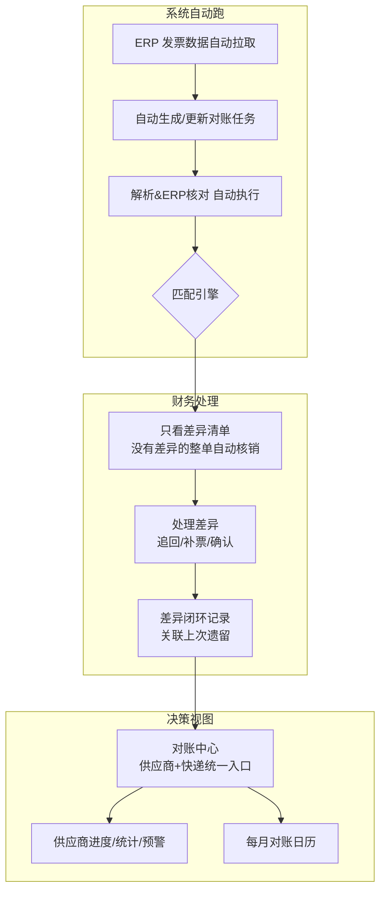

# 对账系统 · 业务流程梳理（v2 草案）

> 本文档只讲**业务流**，不讲代码。目标：对齐"对账系统到底在干什么、哪里不对、v2 应该怎么走"。
> 配套阅读：`docs/v1-项目分析.md`（系统全貌 + 技术问题清单）。

---

## 1. 对账系统的本质（一句话）

**把"人工核对账单"这个又慢又容易漏的活儿，变成"上传文件 → 系统自动比对 → 找出差异 → 留痕可追溯"。**

对账 = 核对两本账：

| 账本 A | 账本 B | 对账目的 |
|--------|--------|----------|
| 供应商寄来的对账单（欠款明细） | 系统/ERP 里的发票数据 | 应付款对不对，差异在哪 |
| 快递公司月结账单（单号+费用） | 系统里的发货记录 | 物流费对不对，防止多收 |

---

## 2. v1 业务流程全景（现状）

```mermaid
flowchart TB
    subgraph 供应商对账主流程
        A[供应商寄来对账单<br/>PDF/Excel/图片] --> B[财务上传系统<br/>新建对账单]
        B --> C[系统解析<br/>提取供应商/期间/明细/余额]
        C --> D[系统核对 ERP<br/>供应商是否存在·编码对不对]
        D --> E{解析&核对<br/>通过?}
        E -->|否| F[人工修正<br/>补字段/改识别]
        F --> C
        E -->|是| G[系统自动匹配<br/>发票 ⇄ 对账单明细]
        G --> H[财务逐行处理<br/>full确认/partial看差异/unmatched追因]
        H --> I[确认核销<br/>生成对账结果]
        I --> J[差异处理<br/>多付追回·漏付补付]
        J --> K[回款管理<br/>超30天预警]
    end

    subgraph 快递对账流程
        L[快递公司月结账单 Excel] --> M[财务上传模板]
        M --> N[系统按单号匹配<br/>系统发货+退换货]
        N --> O[三类结果<br/>匹配成功/仅系统/仅快递账单]
        O --> P[下载 Excel 找快递核对]
    end

    subgraph 共享底座
        Q[发票数据<br/>来自ERP导入] --> G
        R[供应商主数据<br/>阿里云ERP只读] --> D
    end
```

---

## 3. 各环节：谁做、系统做什么、人要做什么

| # | 环节 | 谁做 | 系统做什么 | 人要做什么 | 产出 |
|---|------|------|-----------|-----------|------|
| 1 | 收账单 | 供应商 | — | 财务收文件 | 对账单文件 |
| 2 | 上传 | 财务 | 存文件、生成唯一标识 | 选文件、填期间/备注 | 一条对账任务 |
| 3 | 解析 | **系统** | 提取供应商/明细/四项资金 | 识别率低时要补字段 | 结构化明细 |
| 4 | ERP 核对 | **系统** | 验供应商真伪、编码对齐 | 异常时人工确认 | 可信度标记 |
| 5 | 匹配 | **系统** | 发票×对账单评分 | 信任结果 | full / partial / unmatched |
| 6 | 逐行处理 | **财务** | 展示差异 | 人工判断每一行 | 处理结论 |
| 7 | 核销 | 财务 | 生成结果 | 确认 | 核销记录 |
| 8 | 差异处理 | 财务/供应商 | 记录 | 追钱/补票 | 差异清单 |
| 9 | 回款 | 财务 | 跟踪 + 超30天预警 | 催收 | 回款状态 |

---

## 4. v1 流程上的"不对"点（业务视角）

| # | 别扭点 | 业务影响 |
|---|--------|----------|
| 1 | **两条对账流程完全割裂**：供应商对账管"钱"，快递对账管"物流费"，入口/页面/结果两套 | 财务要记两个系统，口径不统一 |
| 2 | **流程是人推着系统走**：每张账单都要手动上传→手动处理→手动核销，系统没有自动跑批 | 账单一多还是累 |
| 3 | **匹配是"建议"不是"结论"**：大量行落到 partial，财务还得逐行看 | 系统的价值被人工环节稀释 |
| 4 | **差异处理没有闭环**：找出差异→谁处理→结果回不回系统？追回/补付后流程就断了 | 下个月同样的差异还会再犯 |
| 5 | **月份口径混乱**：快递账单按自然月匹配当月发货，实际月结可能跨月 | 误判"仅快递账单"，跟快递扯皮 |
| 6 | **退换货参与不完整**：退换货只参与"匹配成功"，不参与"仅系统"统计 | 漏了对账项 |
| 7 | **对账没有定期节奏**：有账单才跑，没有计划任务，没人催就没人对 | 对账滞后，回款/付款都受影响 |

---

## 5. v2 流程梳理 · 待拍板的 6 个业务问题

> 这 6 个问题的答案，直接决定 v2 的流程骨架。先对齐再画目标流程图。

### Q1 对账的起点是谁？
- A. 被动：供应商寄了账单，财务上传才跑（现状）
- B. 主动：系统定期自动从 ERP 拉发票数据，自己生成对账任务
- C. 混合：发票侧自动拉，账单侧上传

### Q2 谁是对账的主角？
- A. 财务一个人全流程（现状）
- B. 分角色：录入员上传 / 财务审核 / 老板看结果
- C. 其他

### Q3 系统的核心产出应该是什么？
- A. 差异清单（哪些对不上，人工去处理）
- B. 直接给结论（该付多少钱，差异自动消掉）
- C. 对账完成凭证（审计留痕为主）

### Q4 差异要不要闭环？
- 找出差异后，追回的退款 / 补开的发票，**记不记回系统**？
- 理想态：本月差异 = 上月遗留 + 本月新增，逐月可追踪。

### Q5 两套对账要不要合并？
- A. 统一成一个"对账中心"（供应商对账 + 快递对账一个入口）
- B. 各管各的（现状）
- C. 统一入口但流程分开

### Q6 一个月对几次账？
- A. 每月固定跑一次（月结）
- B. 有账单才跑（现状）
- C. 其他（如半月结 / 按供应商错峰）

---

## 6. v2 流程方向（初稿，等上面 6 个问题答案后细化）

v2 的三个核心变化（候选）：
1. **能自动的尽量自动**：ERP 发票自动拉取、解析自动跑、无差异自动核销
2. **人工只看差异**：把财务时间花在"对不上的地方"，而不是逐行确认
3. **差异闭环**：追回/补付结果记回系统，形成逐月可追踪的差异台账

---

## 7. 下一步

- [ ] 拍板第 5 节的 6 个问题
- [ ] 画 v2 目标流程图（定稿）
- [ ] 按流程拆功能点 → 对比 v1 差距 → 排开发计划
