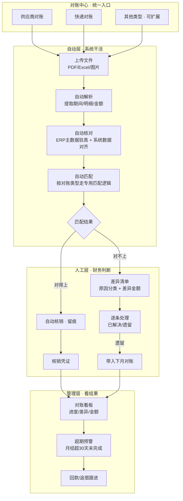

# V3 · 对账 v2 方案（结果版）

> 前置文档：`v1-项目分析.md`（现状全貌）、`v2-业务流程梳理.md`（流程问题）
> 本文档把 v2 的 6 个待拍板问题收敛成**决定**，输出目标流程 + 功能清单 + 落地顺序。
> 每个决定都标注「可改」——这些是我基于行业最佳实践和系统现状给的默认答案，你拍板后生效。

---

## 一、6 个问题的最终决定

| # | 问题 | 决定（默认答案） | 依据 | 可改 |
|---|------|----------------|------|:---:|
| 1 | 对账起点：主动还是被动 | **混合**：账单驱动为主（供应商/快递寄来账单 → 上传即跑），系统不自动拉取；但**每月自动生成"对账日历"提醒未完成的账单** | 对账必须留痕、必须人工确认，全自动不可控 | ✅ |
| 2 | 谁是对账主角 | **分 3 层角色**：财务（上传/处理/核销）、管理层（看差异/进度/预警）、管理员（配置）。不做复杂 RBAC，沿用现有角色体系 | 简单可落地 | ✅ |
| 3 | 系统核心产出 | **三件套**：① 差异清单（对不上的明细 + 差异金额）② 核销结果（对得上的自动核销、留痕）③ 对账看板（每供应商/每期进度 + 超期预警） | 直接给结论，而不是给一堆建议 | ✅ |
| 4 | 差异怎么闭环 | **差异状态机**：待处理 → 处理中 → 已解决 → 遗留；每条差异带**原因分类**（单价差/数量差/漏发票/未发货/其他）；**下月对账自动带入上月遗留差异**，形成"本月 = 上月遗留 + 新增" | 让差异可追踪、可复盘、不重复犯 | ✅ |
| 5 | 两套对账是否合并 | **统一成"对账中心"**：供应商对账和快递对账是两种"对账类型"，共用同一套流程骨架（上传→解析→匹配→差异→核销→看板），各自保留专用解析/匹配逻辑，入口、口径、历史统一 | 消除两套割裂、口径不一致 | ✅ |
| 6 | 对账频率 | **按月结对账**（自然月），按"对账期间"管理而非"上传时间"，支持随时补跑；看板按期间聚合 | 月结是财务通用节奏 | ✅ |

---

## 二、v2 目标业务流程（定稿）

**核心变化（vs v1）**：
1. 一个入口进所有对账，不再两个孤岛页面
2. 差异有状态机 + 原因分类 + 跨月继承，不再"发现即结束"
3. 看板给管理层结论，不再靠 Excel 下载后人工汇总

---

## 三、v2 功能清单

### P0 · 必须（v2 落地主线）

| 功能 | 说明 |
|------|------|
| 对账中心统一入口 | 供应商/快递两种类型共用一个页面框架和流程骨架 |
| 差异清单升级 | 每行差异：金额差、原因分类、状态、处理人、处理时间 |
| 差异状态机 | 待处理→处理中→已解决→遗留，全流程留痕 |
| 遗留差异跨月带入 | 下月对账自动带上月遗留，附"是否已解决"标记 |
| 对账看板 | 按供应商/类型/期间显示：总金额、匹配率、差异数、超期数 |
| 超期预警完善 | 月结超 30 天未完成自动标红 + 提醒 |

### P1 · 重要（v1 结构性问题的修复）

| 功能 | 修什么 |
|------|--------|
| 物料匹配多级化 | 编码直配 → 映射表 → 名称相似 → 规格模糊，**35% 权重从"全有全无"变"渐进得分"** |
| 日期口径修正 | 按"对账期间"对齐，不再拿开票日硬比交货日 |
| 快递"仅系统"补全 | 退换货发货单号也参与"仅系统"统计，与"匹配成功"对称 |
| 快递跨月结算 | 账单按期间匹配，避免跨月单号误判"仅快递账单" |
| 金额硬门槛放开 | 汇总匹配支持合理差异（如拆单/部分开票），不再只认完全相等 |

### P2 · 增强（有精力再做）

| 功能 | 说明 |
|------|------|
| 解析质量反馈 | 解析错误自动记录，后续优化规则（解析层闭环） |
| 对账日历 | 每月提醒"该对账的供应商还没传账单" |
| 导出报告 | 对账月报 PDF/Excel，含差异原因分布统计 |

---

## 四、落地顺序（建议分 4 步走）

| 步骤 | 内容 | 预估 |
|------|------|------|
| ① 修炸弹 | feedback_engine 的 SQLite 语法残留 + models.py 清理收尾（纯代码，不影响流程） | 半天 |
| ② 统一骨架 | 对账中心入口 + 差异状态机 + 差异清单升级（P0 主体） | 3-5 天 |
| ③ 快递并入 | 快递对账改走统一骨架，补"仅系统退换货"、跨月结算 | 2-3 天 |
| ④ 匹配重构 | 物料多级评分 + 日期口径 + 金额门槛放开 + 遗留差异跨月带入 | 3-5 天 |

> ①② 做完即可上线一版；③④ 属于 v2 完整版。

---

## 五、需要你拍板的 3 个点（其余按默认执行）

1. **差异原因分类**：默认 5 类（单价差/数量差/漏发票/未发货/其他），够用吗？还是你有自己的分类口径？
2. **"已解决"的定义**：默认 = 财务确认处理完（追回/补票/确认无碍），需要老板/财务经理复核吗？
3. **对账中心命名**：默认叫"对账中心"，还是沿用"对账核销"叫法？
