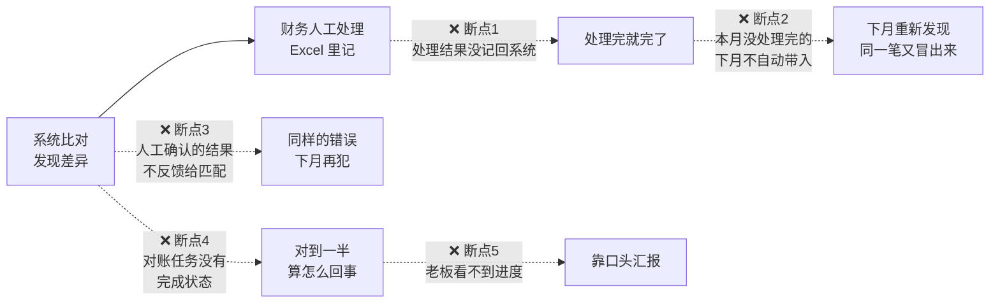
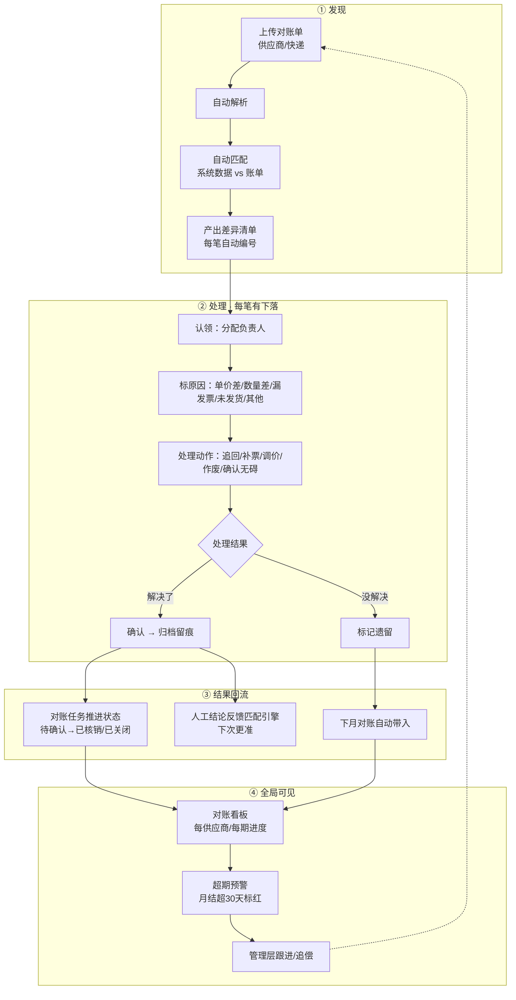

# V4 · 对账闭环设计（核心方案）

> 前置文档：`v1-项目分析.md`（现状）、`v2-业务流程梳理.md`（流程问题）、`v3-对账v2方案结果.md`（6项决定）
> 本文档回答唯一的核心问题：**v2 要做的"闭环"到底是什么、怎么接上。**
> 这是纯业务流程设计，不含任何代码实现细节。

---

## 一、一句话定义

**对账闭环 = 每一笔对不上的账，从"发现"到"最终了结"全程有记录、有下落、有结果，结果回流系统，跨月不丢，管理者随时看得到全局。**

v1 只做了"发现差异"，后面全靠人脑 + Excel 记，所以**始终没有闭环**。

---

## 二、v1 的 5 个断点（为什么没闭环）



| # | 断点 | 业务后果 |
|---|------|---------|
| 1 | 处理结果不记回系统 | 差异处理过程无据可查，审计/复盘无记录 |
| 2 | 跨月不继承 | 同一笔差异下月重新发现，重复劳动、容易漏 |
| 3 | 人工结果不反馈 | 匹配引擎不学习，同样的错误反复犯 |
| 4 | 任务无完成状态 | 对账对到一半算不算完？没人说得清 |
| 5 | 管理层看不到进度 | 只能靠财务口头汇报，无法监督 |

---

## 三、闭环的 4 层（全部接上 = 完整闭环）

### L1 · 差异级闭环 —— 每一笔差异有头有尾

```
发现 → 认领 → 处理 → 确认 → 归档
│      │      │      │      └─ 留痕可追溯（谁、何时、什么结果）
│      │      │      └─ 已解决 / 遗留 二选一
│      │      └─ 处理动作：追回 / 补票 / 调价 / 作废 / 确认无碍
│      └─ 标原因：单价差 / 数量差 / 漏发票 / 未发货 / 其他
└─ 系统比对产出，自动编号进差异清单
```

### L2 · 任务级闭环 —— 一次对账有始有终

```
对账任务状态：草稿 → 对账中 → 待确认 → 已核销（无遗留）/ 已关闭（有遗留）
```

- 每个状态都有时间戳和操作人
- 只有"已核销"或"已关闭"才算出完

### L3 · 月度滚动闭环 —— 跨月不丢

```
上月对账 ──遗留──▶ 本月对账 = 上月遗留 + 本月新增 ──遗留──▶ 下月对账 …
```

- 本月对账打开时，自动带上所有"未解决"的上月差异
- 每笔遗留带"来源月份"标记，可追溯是几月冒出来的

### L4 · 质量闭环 —— 越对越准

```
人工确认结果 ──▶ 反馈匹配引擎 ──▶ 下次同款自动匹配成功 ──▶ 减少人工
```

- 例：人工确认"供应商A的料号 X = 系统料号 Y"，下次对账自动命中
- 人工处理得越多，系统越准，人工越来越少

---

## 四、闭环完整流程图（v2 目标）



---

## 五、闭环功能清单（每个功能接哪个环）

| 环节 | 功能 | 接的环 | 说明 |
|------|------|--------|------|
| 发现 | 差异清单 | L1 | 每行差异：金额差、原因、状态、负责人、处理时间 |
| 认领 | 负责人分配 | L1 | 差异可指派，明确"谁负责" |
| 处理 | 处理动作记录 | L1 | 追回/补票/调价/作废/确认无碍，动作留痕 |
| 确认 | 核销确认 | L1+L2 | 已解决归档；任务推进到待确认→已核销 |
| 继承 | 遗留差异跨月带入 | L3 | 本月=上月遗留+新增，带来源月份 |
| 反馈 | 匹配结果反馈 | L4 | 人工确认回流匹配引擎 |
| 全局 | 对账看板 | 全局 | 每供应商/每期：总金额、匹配率、差异数、超期数 |
| 全局 | 超期预警 | 全局 | 月结超30天未完成标红+提醒 |

---

## 六、闭环验收清单（怎么算"闭环了"）

对任意一笔差异，能回答以下 6 个问题 = 闭环：

| # | 问题 | v1 能答吗 |
|---|------|:---:|
| 1 | 这笔差异是谁发现的？ | ✅ 系统 |
| 2 | 谁负责处理？ | ❌ 靠人记 |
| 3 | 什么原因？ | ❌ |
| 4 | 怎么处理的、结果如何？ | ❌ 处理完就没了 |
| 5 | 处理结果留痕可追溯吗？ | ❌ |
| 6 | 没处理完的，下月还看得见吗？ | ❌ 重新发现 |

**6 个问题全答得上，闭环就成了。**

---

## 七、落地顺序（按"接环"推进）

| 步骤 | 接哪个环 | 内容 | 预估 |
|------|---------|------|------|
| ① 差异清单升级 | L1 | 差异每笔编号 + 原因分类 + 状态 + 负责人 | 3-5 天 |
| ② 处理动作与确认 | L1+L2 | 处理动作记录 + 归档 + 任务状态机（草稿→已核销/已关闭） | 3-5 天 |
| ③ 遗留跨月带入 | L3 | 本月=上月遗留+新增，带来源月份 | 2-3 天 |
| ④ 匹配结果反馈 | L4 | 人工结论回流匹配引擎，越对越准 | 3-5 天 |
| ⑤ 看板与预警 | 全局 | 每供应商/每期进度 + 超30天预警 | 2-3 天 |

> ①-③ 做完，差异级/任务级/月度滚动三层闭环就通了（核心）；
> ④⑤ 做完，质量闭环和全局可见也通了（完整闭环）。

---

## 八、待你拍板（其余按默认执行）

1. **差异原因分类**：默认 5 类（单价差/数量差/漏发票/未发货/其他），够吗？
2. **"已解决"定义**：默认 = 财务确认处理完，需要财务经理复核吗？
3. **遗留差异要不要设处理时限**：默认不限，只做超期提醒（30天），需要硬性时限吗？
