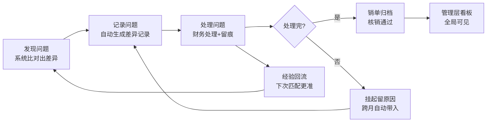

# 对账系统需求梳理（闭环版）

> 版本：v1.0
> 日期：2025-08-01
> 状态：待业务确认
> 说明：本文档只梳理"要什么、为什么、怎么算做好"，不涉及技术实现。

---

## 1. 这份文档是干什么的

把"对账系统应该做成什么样"这件事，从头到尾想清楚、写下来：

```
为什么做 → 现在缺什么 → 要什么 → 不要什么 → 怎么算做好 → 谁来定
```

写完这份文档，我们对"要做的事"就完全一致了，之后任何人照着做都不会跑偏。

---

## 2. 我们为什么要做这个系统（背景）

公司每个月有两笔账要对，过去靠人工，问题很多：

| 对账类型 | 对的是什么 | 过去怎么干的 | 痛点 |
|---------|-----------|-------------|------|
| 供应商对账 | 供应商寄来的对账单 vs 系统里的发票数据 | 财务下载Excel，一行行比对 | 慢（几天）、容易漏、容易错 |
| 快递对账 | 快递公司月度账单 vs 系统发货记录 | 按单号人工核对 | 单子多、对不过来、快递多收费难发现 |

**核心目的只有一个：把钱算清楚，防止多付钱、漏收钱、发现问题找不到人。**

---

## 3. 系统现在做成什么样了（现状盘点）

已经有的能力（先承认成果）：

- ✅ 上传对账单（PDF/Excel/图片），系统自动解析出明细
- ✅ 系统核对 ERP（供应商是不是真的、编码对不对）
- ✅ 系统自动比对（发票 vs 对账单，能标出哪些对得上、哪些对不上）
- ✅ 逐行校验（PASS 对得上 / 异常对不上 / 超额）
- ✅ 付款记录、审计日志、反馈引擎（记录人工纠正）

**已经解决的问题**：把"人工逐行对账"变成了"系统比对 + 人工确认"。

---

## 4. 最大的问题：没有闭环（差距分析）

现状是：**系统负责"找问题"，但不负责"跟踪问题"**。

| # | 断点 | 具体表现 | 后果 |
|---|------|---------|------|
| 1 | 差异无下落 | 对不上的行标红了，但没有任何记录说明"谁在处理、处理到哪了、怎么处理的" | 处理过程全靠人记，人走了就断 |
| 2 | 跨月丢失 | 这个月没处理完的差异，下个月对账时重新冒出来，系统不记得"这是上个月的遗留" | 同样的活干两遍，甚至永远处理不完 |
| 3 | 带病核销 | 明明有对不上的，财务还是能一键"确认对账"变成已完成 | 账"核销"了，但问题还在，等于假闭环 |
| 4 | 经验不积累 | 人工纠正过的错误，系统不学，下个月同样的错再犯一遍 | 效率提不上去 |
| 5 | 无全局视图 | 老板想看看"这个月对了几家、几家有问题、处理完没有"，没有地方能一眼看到 | 靠财务口头汇报 |

**一句话：系统只做了"对账"的前半段（找出差异），后半段（处理差异）全靠人，而人没有工具。**

---

## 5. 我们到底要什么（核心需求）

### 5.1 总体目标

> **把每一笔"对不上的账"从"发现"到"了结"，全程记在系统里，可跟踪、可追溯、跨月不丢、管理层可看。**

### 5.2 需求清单（按重要程度分三档）

#### P0：核心闭环（必须做）

| 编号 | 需求 | 大白话 |
|------|------|--------|
| N1 | 统一对账入口 | 供应商对账、快递对账，都在一个入口进，不用记两套操作 |
| N2 | 差异自动记录 | 系统比对后，每笔"对不上的"自动生成一条记录（谁、哪家供应商、什么问题、多少钱） |
| N3 | 差异状态跟踪 | 每条差异有状态：待处理 → 处理中 → 已处理（记处理方式）/ 挂起（记原因） |
| N4 | 差异处理留痕 | 谁处理的、什么时候、怎么处理的、处理结果，全部记下来 |
| N5 | 跨月自动带入 | 上个月没处理完的差异，下个月对账自动带过来，接着处理 |
| N6 | 差异清单页 | 一个页面看所有差异：按供应商/月份/状态筛选，处理不完的醒目提醒 |
| N7 | 核销管控 | 有差异没处理完，不允许直接"确认对账"（或必须填写原因说明） |

#### P1：增强（应该做）

| 编号 | 需求 | 大白话 |
|------|------|--------|
| N8 | 处理结果回流匹配 | 人工确认过的匹配，系统记住，下次自动加分，越对越准 |
| N9 | 管理层看板 | 老板一屏看到：本月对了几家、几家有问题、问题处理进度、超期预警 |
| N10 | 超期提醒 | 差异挂起超过30天，自动标红提醒 |
| N11 | 快递对账并入统一流程 | 快递账单也走"上传→比对→差异跟踪"的同一套流程 |

#### P2：远期（可以做）

| 编号 | 需求 | 大白话 |
|------|------|--------|
| N12 | 对账日历 | 每月固定时间提醒该对账了 |
| N13 | 月度对账报表 | 一键导出本月对账结果给领导/审计 |

---

## 6. 不要什么（范围边界）

明确不做，避免跑偏：

- ❌ 不做自动付款（钱怎么付还是财务说了算）
- ❌ 不做全自动对账（最终确认必须人工，系统只辅助）
- ❌ 不做发票识别大重构（现有解析能用就先用）
- ❌ 不做移动端 App（先做网页）
- ❌ 不做多公司多账套（当前就服务本公司）

---

## 7. 怎么算"闭环"做成了（验收标准）

拿任意一笔差异，能回答出下面 6 个问题，就是闭环了：

| # | 问题 | v1 现状 | 目标 |
|---|------|---------|------|
| 1 | 这笔差异是谁发现的？ | ❌ 说不清 | ✅ 系统记录（对账任务） |
| 2 | 是哪个供应商、哪个月、哪笔业务？ | ⚠️ 要翻 | ✅ 一点就查到 |
| 3 | 差异原因是什么？ | ❌ 靠记 | ✅ 有分类（单价差/数量差/漏发票/未发货/其他） |
| 4 | 谁负责处理？处理到哪了？ | ❌ 不知道 | ✅ 状态+处理人 |
| 5 | 怎么处理的？结果留痕了吗？ | ❌ 没留 | ✅ 处理方式+时间+备注 |
| 6 | 下个月还看得见吗？ | ❌ 重新冒 | ✅ 自动带入，注明"上月遗留" |

---

## 8. 需要业务拍板的问题（不拍板就无法开工）

| # | 问题 | 默认建议 | 需要你确认 |
|---|------|---------|-----------|
| Q1 | 差异原因分几类？ | 5类：单价差/数量差/漏发票/未发货/其他 | 够吗？要加吗？ |
| Q2 | 处理方式有哪几种？ | 5种：补票/冲销/追回/忽略/其他 | 够吗？ |
| Q3 | 谁能把差异标成"挂起/遗留"？ | 财务即可，但必须填原因 | 要经理审批吗？ |
| Q4 | 有差异没处理完，能核销吗？ | 允许，但必须填说明 | 还是完全禁止？ |
| Q5 | 这个功能叫什么名字？ | "差异管理" / "问题单" / "对账中心" | 你定 |
| Q6 | 先上线哪部分？ | 先做 N1-N7（核心闭环），再 N8-N11 | 你定 |
| Q7 | 快递对账并入统一流程，是这次一起做，还是下期？ | 下期（P1） | 你定 |

---

## 9. 需求闭环图



---

## 10. 下一步

1. 你逐条确认第 8 节的 Q1-Q7（有异议直接说）
2. 确认后，本文档升级为 v1.0 定稿
3. 之后才进入"怎么做"（方案/开发），那是另一份文档的事
